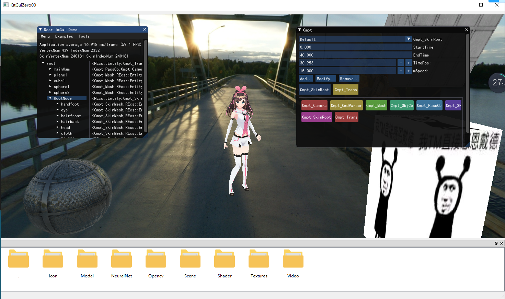

# ToyRenderEngine
A Render Engine Based on Dx12 Windows plaform。
- **Just For Windows,Need VS2019 or upper version.**
- **Use Qt5 and imgui,need install qt-opensource-windows-x86-5.12.2.**

## Function
- Base on scene tree to control scene,can delete and import new model.(Just support fbx now)
- Can instance new material and set texture,such as add new skybox's texture.
- Release PBR,Skybox,simple SSAO.
- Can split and play animation frame.
- Can save and load scene.

## How To Use?
Just click **build_default.bat**,and wait vsproj's generation.

## Picture

